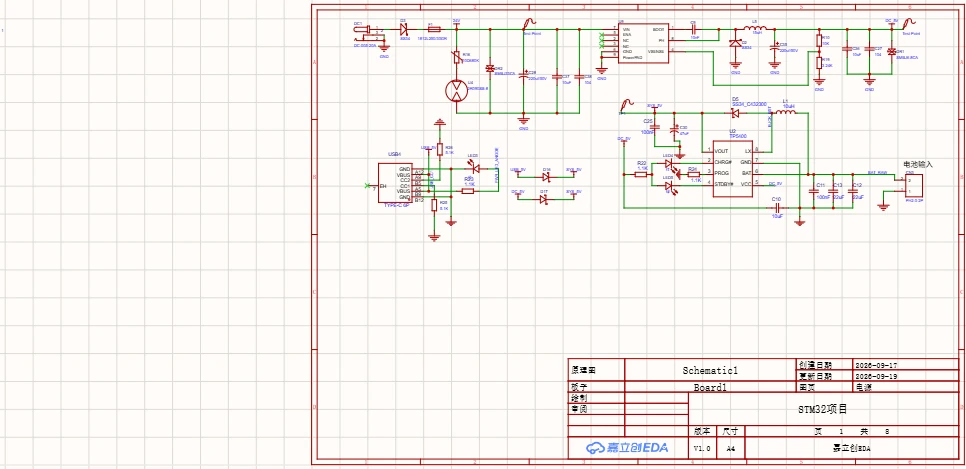
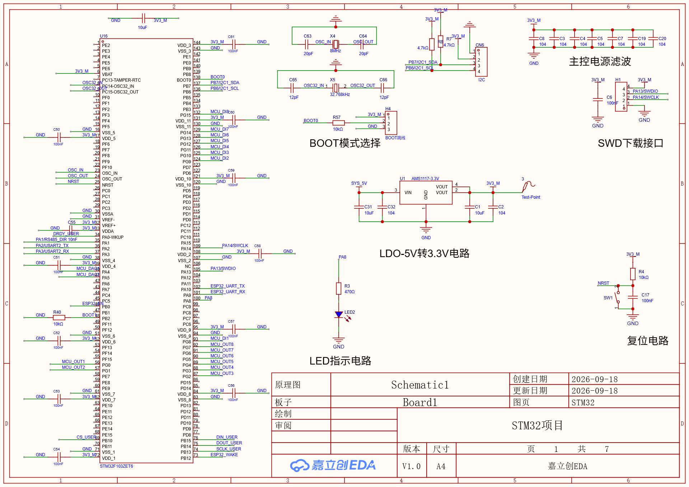
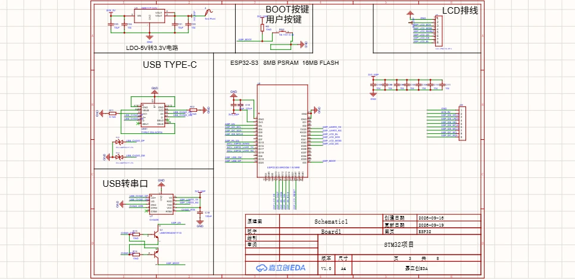
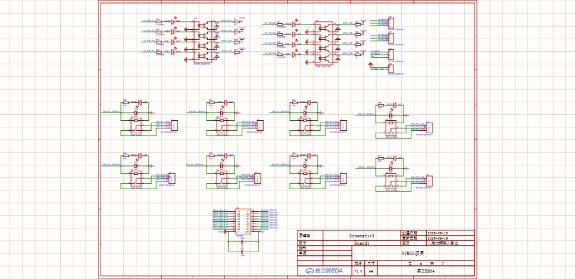
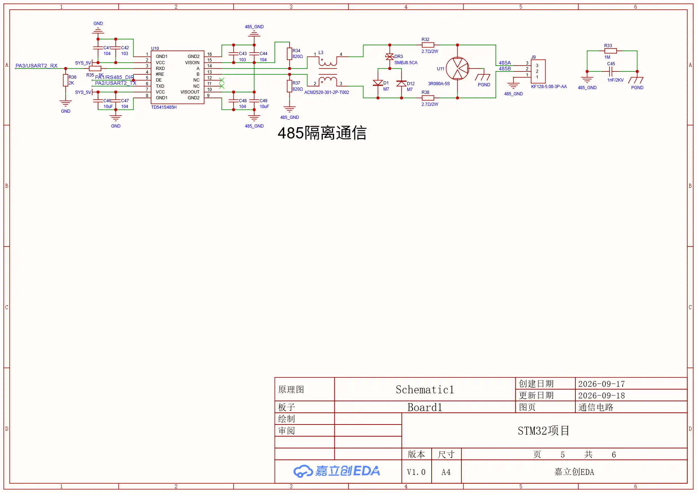
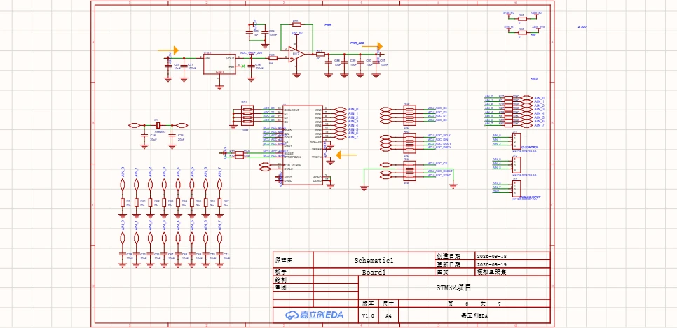
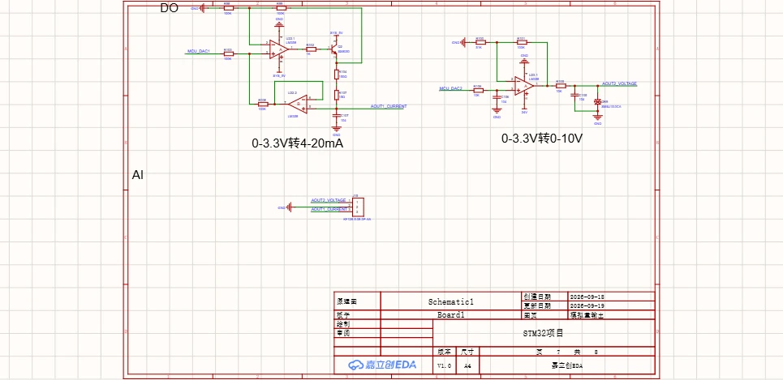
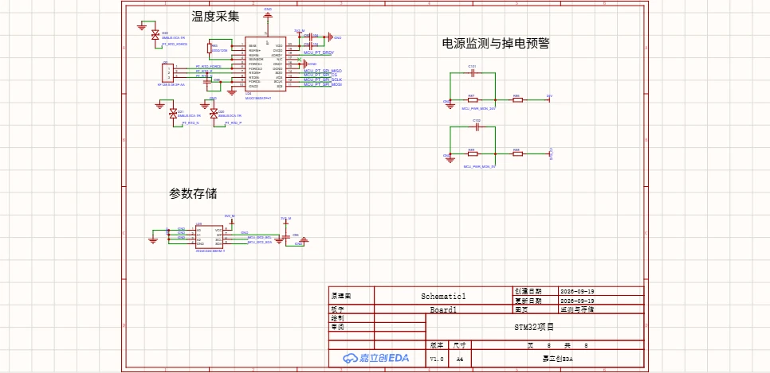

# 基于 STM32F103ZET6 与 ESP32-S3 的工业采集控制终端

<p align="center">
  <strong>STM32 负责实时采集和控制，ESP32-S3 负责显示、联网和远程交互</strong>
</p>

<p align="center">
  
  
  
  
  
</p>

## 项目概述

这是一个面向工业采集与控制场景的双处理器硬件项目。STM32F103ZET6 处理实时任务，包括模拟采集、温度采集、数字输入、继电器控制、参数存储和隔离通信。ESP32-S3-WROOM-1-N16R8 处理 LCD、WiFi、MQTT、语音模块、人机交互和 OTA。

两个处理器通过 UART 通信。STM32 上报采集值、设备状态和报警事件。ESP32-S3 下发配置和控制命令。网络任务与实时控制分离，互不阻塞。

## 核心能力

| 能力 | 实现 |
| --- | --- |
| 高精度模拟采集 | ADS1256 八通道 24 位 ADC，ADR421 提供 2.5V 基准 |
| 工业模拟输出 | LM358 实现 0 到 10V 电压输出和 4 到 20mA 电流输出 |
| 温度采集 | MAX31865 连接 PT100 或 PT1000，现场端增加 TVS 保护 |
| 参数存储 | AT24C32D EEPROM，独立 I2C2 总线 |
| 电源监测 | 24V 和 5V 分压监测，PC0 与 PC1 输入 |
| 隔离数字输入 | 八路 TLP291-4 光耦输入 |
| 继电器输出 | ULN2803 驱动八路继电器 |
| 隔离通信 | RS485、RS232 和 CAN 三路隔离接口 |
| 显示与联网 | ESP32-S3 驱动 LCD，并通过 WiFi 连接 MQTT 或云端 |
| 音频扩展 | 1×9 接口连接 ES8311 与 NS4150B 音频模块 |

## 系统架构

```text
现场模拟信号
    │
    ▼
输入调理与滤波
    │
    ▼
ADS1256 24 位 ADC ── SPI2 ──┐
                            │
PT100 或 PT1000 ─ MAX31865 ─ SPI3
                            │
八路光耦输入 ──────────────┤
                            ▼
                ┌─────────────────────┐
                │ STM32F103ZET6       │
                │ 实时采集、控制、报警 │
                │ EEPROM、电源监测     │
                └──────────┬──────────┘
                           │ UART
                           ▼
                ┌─────────────────────┐
                │ ESP32-S3            │
                │ LCD、WiFi、MQTT、OTA │
                └──────────┬──────────┘
                           │
                           ▼
                     浏览器或云平台
```

## 硬件模块

| 模块 | 主要器件 | 作用 |
| --- | --- | --- |
| 主控 | STM32F103ZET6 | 实时采集和本地控制 |
| 联网 | ESP32-S3-WROOM-1-N16R8 | LCD、WiFi、MQTT、音频接口和 OTA |
| 模拟输入 | ADS1256、ADR421 | 八通道 24 位采集与精密基准 |
| 温度输入 | MAX31865ATP+T、SMBJ5.0CA | PT100 或 PT1000 采集与现场保护 |
| 参数存储 | AT24C32D-SSHM-T | 保存校准参数、阈值和设备配置 |
| 模拟输出 | LM358 | 0 到 10V 和 4 到 20mA 输出 |
| 数字输入 | TLP291-4 | 八路隔离输入 |
| 数字输出 | ULN2803、G5Q-14 | 八路继电器驱动 |
| RS485 | TD541S485H、ACM2520 | 隔离 RS485 |
| RS232 | TDH541S232H | 隔离 RS232 |
| CAN | TDH541SCANFD | 隔离 CAN |
| 电源 | 24V 输入、TPS5430、AMS1117、TP5400 | 多路供电与电池路径 |
| 电源监测 | 100k 与 10k 分压、10k 与 10k 分压 | 24V 和 5V 监测 |

详细电路参数见[硬件设计说明](Documentation/hardware.md)。最终引脚分配见[IO 与接口规划](Documentation/io-map.md)。

## 接口

| 接口 | 数量 | 说明 |
| --- | ---: | --- |
| 模拟输入 | 8 | ADS1256 通道 |
| 模拟输出 | 2 | 0 到 10V 和 4 到 20mA |
| 温度输入 | 1 | MAX31865 与 PT100 或 PT1000 |
| 光耦输入 | 8 | TLP291-4 隔离 |
| 继电器输出 | 8 | ULN2803 驱动 |
| RS485 | 1 | 隔离总线接口 |
| RS232 | 1 | 隔离串口 |
| CAN | 1 | 隔离 CAN |
| LCD | 1 | ST7789 或兼容 SPI 屏 |
| 音频模块 | 1 | 1×9 接口，连接 ES8311 与 NS4150B |
| STM32 与 ESP32 | 1 | UART |
| SWD | 1 | STM32 下载和调试 |
| USB | 1 | ESP32-S3 下载和调试 |

## 设计要点

### 双处理器分工

STM32 保留实时控制路径。ADC、光耦输入、继电器和现场总线都直接连接 STM32。ESP32-S3 不参与硬实时控制，只处理显示、网络、配置和 OTA。

### IO 分组

原理图按物理封装和接口类别安排引脚。继电器集中在 `PD8` 到 `PD15`，数字输入集中在 `PD2` 和 `PG9` 到 `PG15`。ADS1256 的 SPI 与控制线集中在右侧，MAX31865、EEPROM 和外部 I2C 集中在下方。

### 高精度模拟链路

模拟输入进入 ADS1256 前经过串阻和滤波。基准链路使用 ADR421 和运放缓冲，降低基准负载变化对采集结果的影响。

### 温度通道保护

MAX31865 的 `RTD_P`、`RTD_N` 和 `RTD_FORCE` 现场线各增加一个 `SMBJ5.0CA` 双向 TVS。差分滤波电容 `C95` 保留在 `PT_RTD_P` 与 `PT_RTD_N` 之间。

### 电源监测与掉电预警

24V 电压通过 `100kΩ` 与 `10kΩ` 分压后进入 `PC0`。5V 电压通过 `10kΩ` 与 `10kΩ` 分压后进入 `PC1`。两个节点各有一个 `100nF` 滤波电容。软件可轮询采样值并判断过压、欠压和掉电。

### EEPROM 独立总线

板载 AT24C32D 使用 `I2C2`，地址为 `0x50`。外部 I2C 接口继续使用 `I2C1`，两条总线互不影响。`A0`、`A1`、`A2` 和 `WP` 都接 GND，写入默认启用。

### 音频模块接口

`J22` 使用 1×9、2.54mm 接口，脚序与模块手册一致：

| 引脚 | 模块信号 | ESP32-S3 网络 |
| ---: | --- | --- |
| 1 | GND | GND |
| 2 | 5V | SYS_5V |
| 3 | DIN | ESP_I2S_DOUT |
| 4 | LRCK | ESP_I2S_LRCK |
| 5 | DOUT | ESP_I2S_DIN |
| 6 | SCLK | ESP_I2S_BCLK |
| 7 | MCLK | ESP_I2S_MCLK |
| 8 | SCL | ESP_I2C_SCL |
| 9 | SDA | ESP_I2C_SDA |

## 原理图

工程包含 8 个原理图页面。点击图片可以查看大图。

<table align="center">
  <tr>
    <td align="center">
      <a href="Documentation/images/sch-power.webp">
        
      </a>
      <br>
      <sub>电源</sub>
    </td>
    <td align="center">
      <a href="Documentation/images/sch-stm32.webp">
        
      </a>
      <br>
      <sub>STM32 主控</sub>
    </td>
  </tr>
  <tr>
    <td align="center">
      <a href="Documentation/images/sch-esp32.webp">
        
      </a>
      <br>
      <sub>ESP32-S3</sub>
    </td>
    <td align="center">
      <a href="Documentation/images/sch-dio.webp">
        
      </a>
      <br>
      <sub>光耦输入和继电器输出</sub>
    </td>
  </tr>
  <tr>
    <td align="center">
      <a href="Documentation/images/sch-comm.webp">
        
      </a>
      <br>
      <sub>隔离通信</sub>
    </td>
    <td align="center">
      <a href="Documentation/images/sch-ain.webp">
        
      </a>
      <br>
      <sub>模拟量采集</sub>
    </td>
  </tr>
  <tr>
    <td align="center">
      <a href="Documentation/images/sch-aout.webp">
        
      </a>
      <br>
      <sub>模拟量输出</sub>
    </td>
    <td align="center">
      <a href="Documentation/images/sch-monitor-storage.webp">
        
      </a>
      <br>
      <sub>监测与存储</sub>
    </td>
  </tr>
</table>

## 文档

| 文档 | 内容 |
| --- | --- |
| [硬件设计说明](Documentation/hardware.md) | 电源、主控、模拟链路、隔离接口、温度和存储 |
| [IO 与接口规划](Documentation/io-map.md) | STM32 与 ESP32-S3 的最终引脚分配 |
| [项目术语](CONTEXT.md) | 现场侧、控制器侧、通道和模块等统一术语 |
| `Documentation/images/` | 8 页原理图导出图片 |

## 后续计划

- 增加采集校准和输出校准流程。
- 增加固定帧头、长度、序号和 CRC 的板间协议。
- 增加 Web 看板、历史曲线和报警记录。
- 增加 ESP32-S3 OTA 和配置同步。
- 增加连续运行、断电恢复和网络恢复测试。
- 增加语音报警和音频模块功能验证。
