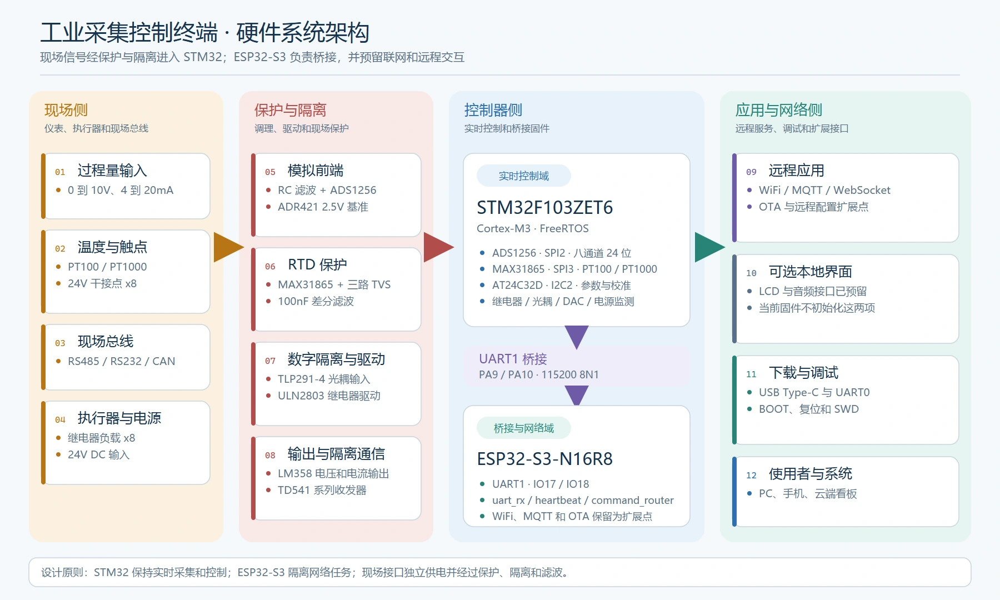
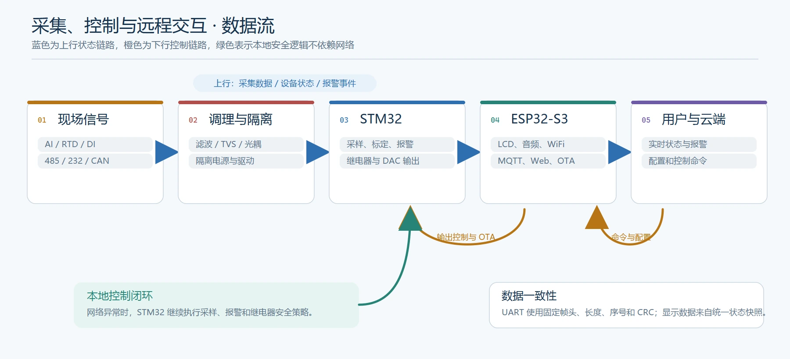
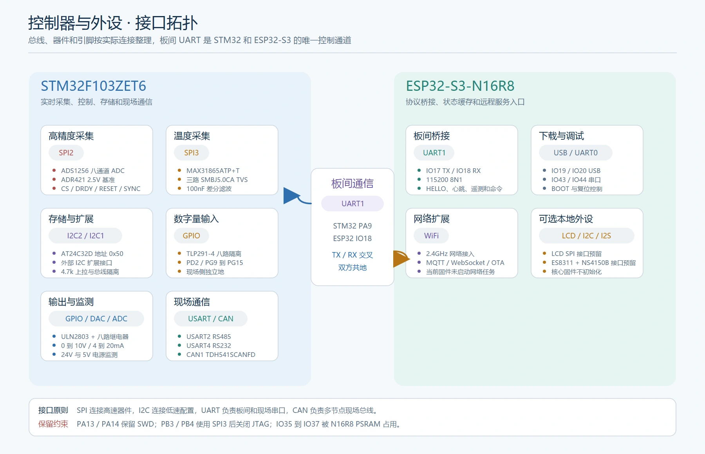
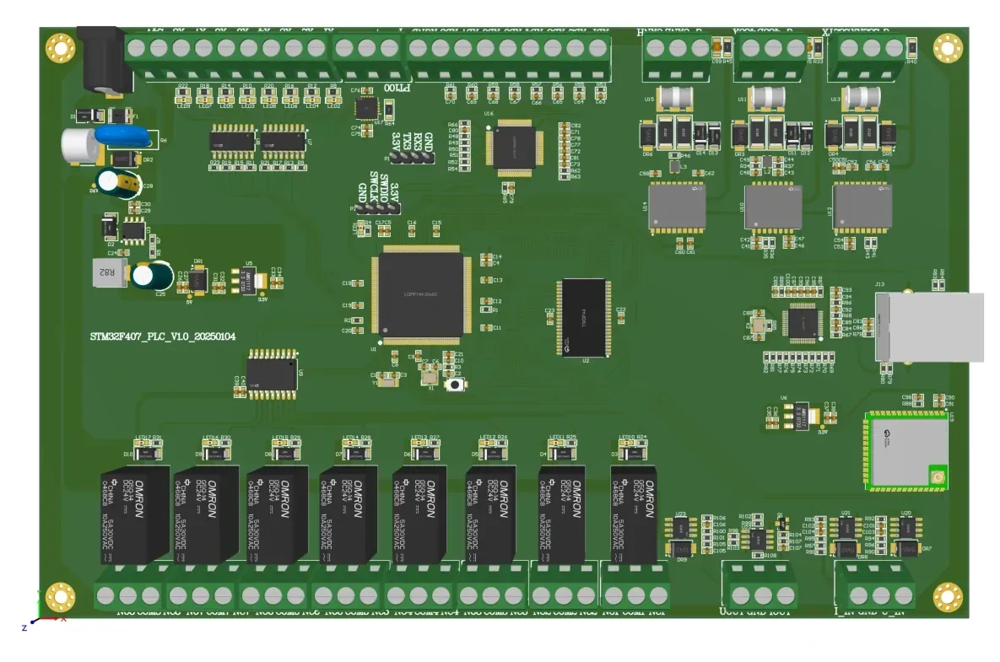

# 基于 STM32F103ZET6 与 ESP32-S3 的工业采集控制终端

<p align="center">
  <strong>STM32 处理实时采集与控制，ESP32-S3 负责桥接、联网和远程交互</strong>
</p>

<p align="center">
  
  
  
  
  
</p>

## 项目概览

这是一套面向工业现场采集与控制的双处理器硬件方案。STM32F103ZET6 承担实时任务，包括 8 路 24 位模拟采集、PT100 或 PT1000 温度采集、8 路隔离数字输入、8 路继电器输出、2 路工业模拟输出、参数存储和隔离通信。

ESP32-S3-WROOM-1-N16R8 负责 UART 桥接、WiFi、MQTT、配置同步和 OTA。LCD 与音频模块作为可选外设，不参与核心采集控制链路。两个处理器通过 UART1 互联，STM32 上报采集值和设备状态，ESP32-S3 下发配置与控制命令。网络任务不占用 STM32 的硬实时路径。

## 关键配置

| 类别 | 配置 |
| --- | --- |
| 实时控制 | STM32F103ZET6，LQFP144，Cortex-M3 |
| 联网与桥接 | ESP32-S3-WROOM-1-N16R8，UART 桥接、WiFi、MQTT、OTA |
| 模拟采集 | ADS1256，8 通道 24 位 ADC；ADR421 提供 2.5V 基准 |
| 温度采集 | MAX31865ATP+T，支持 PT100 和 PT1000 |
| 模拟输出 | LM358，提供 0 到 10V 电压输出和 4 到 20mA 电流输出 |
| 数字量 | 8 路 TLP291-4 光耦输入；8 路 ULN2803 和 G5Q-14 继电器输出 |
| 隔离通信 | RS485、RS232、CAN，均使用隔离收发器 |
| 电源与存储 | 24V 输入、TPS5430、AMS1117、TP5400；AT24C32D EEPROM |

## 功能设计

### 高精度采集与模拟输出

8 路现场模拟量先经过 `10kΩ` 串阻和 `10nF` 到地滤波，再进入 ADS1256。SPI 信号串联 `22Ω`，基准链路使用 ADR421 和运放缓冲，降低基准负载变化对采集结果的影响。

温度通道使用 MAX31865 采集 PT100 或 PT1000。`RTD_P`、`RTD_N` 和 `RTD_FORCE` 各配置一个 `SMBJ5.0CA` 双向 TVS，差分端配置 `100nF` 滤波。

模拟输出由 STM32 的 DAC1 和 DAC2 产生基础电压，再通过 LM358 调理为 `0 到 10V` 电压和 `4 到 20mA` 电流信号。

### 隔离数字量

8 路数字输入通过 TLP291-4 光耦隔离，包含限流、上拉、滤波和状态指示。现场侧与控制器侧使用独立电源和地网络。

8 路继电器由 ULN2803 驱动，输出使用 G5Q-14。每路保留续流二极管、状态指示灯和独立的 `NC`、`COM`、`NO` 端子。

### 隔离通信

RS485 使用 TD541S485H，收发方向由 `PA1` 控制。RS232 使用 TDH541S232H。CAN 使用 TDH541SCANFD，支持 CAN 和 CAN FD。

三路接口均包含隔离电源、瞬态抑制和现场侧保护。RS485 与 CAN 配置终接和瞬态保护。

### 双处理器交互

STM32 直接连接 ADS1256、MAX31865、EEPROM、数字输入、继电器和现场总线。它保留采样、报警和控制路径，网络异常时仍可独立运行。

STM32 与 ESP32-S3 之间的 UART 协议使用固定帧头、版本、长度、序号和 CRC。ESP32-S3 接收遥测和事件，发送控制命令并等待 ACK。LCD 和音频模块为可选外设，不影响核心桥接和采集控制。

## 系统设计

### 系统架构

<p align="center">
  <a href="Documentation/images/arch-system.webp">
    
  </a>
</p>

### 数据流

<p align="center">
  <a href="Documentation/images/arch-data-flow.webp">
    
  </a>
</p>

### 接口拓扑

<p align="center">
  <a href="Documentation/images/arch-io-topology.webp">
    
  </a>
</p>

## 软件实现

### STM32 实时固件

STM32 使用 HAL、FreeRTOS 和 CMSIS-RTOS V2。当前任务分为：

| 任务 | 职责 |
| --- | --- |
| `monitorTask` | 24V、5V 采集和状态灯 |
| `controlTask` | 数字输入消抖、继电器状态同步 |
| `acqTask` | ADS1256 八通道采集 |
| `rtdTask` | MAX31865 温度读取 |
| `bridgeTask` | UART 协议、遥测、事件、命令和 ACK |

采集、控制、故障和配置由 `device_state` 统一管理，任务之间通过 mutex 获取一致快照。

### ESP32-S3 桥接固件

ESP32-S3 使用 ESP-IDF 6.1，通过 UART1 连接 STM32：

| 任务 | 职责 |
| --- | --- |
| `uart_rx` | 接收帧并按字节解析 |
| `heartbeat` | 发送 HELLO 和心跳，检查 STM32 在线状态 |
| `command_router` | 命令发送、确认和重试入口 |

LCD 和音频暂不初始化，板间协议不声明这两项能力。

### 构建

STM32 使用 Keil MDK：

```text
Firmware/stm32/MDK-ARM/stm32_industrial_controller.uvprojx
```

ESP32-S3 使用 ESP-IDF 6.1：

```powershell
cd Firmware/esp32
idf.py set-target esp32s3
idf.py build
```

完整构建和接线说明见 [固件说明](Firmware/README.md)，帧格式见 [板间协议](Software/PROTOCOL.md)。

## 关键设计

### 实时控制与网络任务分离

ADC、光耦输入、继电器和现场总线都直接连接 STM32。ESP32-S3 不参与硬实时控制，只处理显示、网络和远程服务。

### 模拟链路的基准与抗干扰

ADS1256 使用独立模拟电源，ADR421 基准经过运放缓冲。现场输入经过串阻和电容滤波，SPI 信号串联 `22Ω`，降低反射和 EMI。

### 现场接口保护

RTD 输入配置三路双向 TVS。通信接口配置隔离电源、共模电感、瞬态抑制和终接。继电器线圈配置续流回路，输出端与控制侧保持隔离。

### 存储与电源监测

AT24C32D 使用独立 I2C2 总线，地址为 `0x50`。外部扩展继续使用 I2C1，两条总线互不影响。

24V 通过 `100kΩ` 与 `10kΩ` 分压进入 `PC0`。5V 通过 `10kΩ` 与 `10kΩ` 分压进入 `PC1`。两个节点各配置 `100nF` 滤波，软件可以判断过压、欠压和掉电。

### 引脚与扩展

继电器集中在 `PD8` 到 `PD15`。数字输入使用 `PD2` 和 `PG9` 到 `PG15`。ADS1256、MAX31865、EEPROM 和外部 I2C 按总线分组。完整分配见[IO 与接口规划](Documentation/io-map.md)。

## PCB 与原理图

<p align="center">
  <a href="Documentation/images/pcb-layout.webp">
    
  </a>
</p>

PCB 布局展示主要器件、接口端子、电源区域和输出继电器的位置关系。

<details>
<summary><strong>展开查看 8 页原理图</strong></summary>
<br>

<table align="center">
  <tr>
    <td align="center">
      <a href="Documentation/images/sch-power.webp">
        
      </a>
      <br>
      <sub>电源</sub>
    </td>
    <td align="center">
      <a href="Documentation/images/sch-stm32.webp">
        
      </a>
      <br>
      <sub>STM32 主控</sub>
    </td>
  </tr>
  <tr>
    <td align="center">
      <a href="Documentation/images/sch-esp32.webp">
        
      </a>
      <br>
      <sub>ESP32-S3</sub>
    </td>
    <td align="center">
      <a href="Documentation/images/sch-dio.webp">
        
      </a>
      <br>
      <sub>光耦输入和继电器输出</sub>
    </td>
  </tr>
  <tr>
    <td align="center">
      <a href="Documentation/images/sch-comm.webp">
        
      </a>
      <br>
      <sub>隔离通信</sub>
    </td>
    <td align="center">
      <a href="Documentation/images/sch-ain.webp">
        
      </a>
      <br>
      <sub>模拟量采集</sub>
    </td>
  </tr>
  <tr>
    <td align="center">
      <a href="Documentation/images/sch-aout.webp">
        
      </a>
      <br>
      <sub>模拟量输出</sub>
    </td>
    <td align="center">
      <a href="Documentation/images/sch-monitor-storage.webp">
        
      </a>
      <br>
      <sub>监测与存储</sub>
    </td>
  </tr>
</table>

</details>

## 项目资料

| 文档 | 内容 |
| --- | --- |
| [硬件设计说明](Documentation/hardware.md) | 电源、主控、模拟链路、隔离接口、温度和存储 |
| [IO 与接口规划](Documentation/io-map.md) | STM32 与 ESP32-S3 的完整引脚分配 |
| [软件架构](Software/README.md) | STM32、ESP32-S3、任务划分和模块接口 |
| [板间协议](Software/PROTOCOL.md) | UART 帧、消息类型、命令和错误码 |
| [CubeMX 配置清单](Software/CUBEMX.md) | 时钟、外设、GPIO、DMA 和 FreeRTOS 配置顺序 |
| [固件说明](Firmware/README.md) | STM32 与 ESP32-S3 的构建、接线和功能范围 |
| [项目术语](CONTEXT.md) | 现场侧、控制器侧、通道和模块等统一术语 |
| `Documentation/render_architecture.py` | 重新生成系统架构、数据流和接口拓扑图 |
| `Documentation/images/` | PCB 布局、系统框图和 8 页原理图 |
